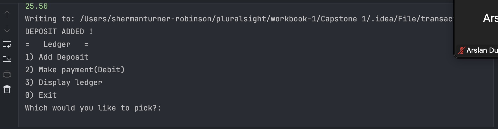

#LEDGER_README

Welcome to **Sherman's Ledger** — a simple and beginner-friendly Java app for managing your personal finances!  
You can record deposits and expenses, track your balance, and store everything in a CSV file!

---

## 📚 Table of Contents

1. [About the Project](#about-the-project)
2. [Features](#features)
3. [Getting Started](#getting-started)
4. [Folder Structure](#folder-structure)
5. [Code Examples](#code-examples)
6. [CSV File Example](#csv-file-example)
7. [Images](#images)
8. [Contributing](#contributing)
9. [License](#license)
10. [Author](#author)

---

## 🧾 About the Project

**Sherman’s Ledger** helps users manage and view their financial transactions.  
It’s a great Java project for learning:
- How to create and use **objects and attributes**
- How to **read and write files** in Java
- How to organize your code with **multiple classes**

This project includes **four main Java classes:**
| Class | Description |
|-------|--------------|
| `HomeScreen` | Handles user interaction and displays the main menu |
| `Transaction` | Represents each individual transaction |
| `TransactionManager` | Manages adding, reading, and saving transactions |
| `Ledger` | Keeps track of all transactions and balance totals |

---

## ⚙️ Features

- 💵 Add deposits or expenses
- 🧾 View all transactions in order
- 💾 Save and load data from `transactions.csv`
- 🧮 Calculate current balance
- 🧠 Beginner-friendly Java structure

---

## 🚀 Getting Started

### Prerequisites
You’ll need:
- Java JDK 17 or higher
- IntelliJ IDEA (recommended)

### Installation

1. Clone the repository:
   ```bash
   git clone <https://github.com/Sherman57-Git/Capstone-1>


## 📊 CSV File Example
'transactions.csv'

2025-10-16|23:04:54|Smoothies|Erewhon|-20.5
2025-10-16|23:34:20|Birthday|The Fam|1000.0
2025-10-16|23:35:53|Flight|United Airlines|-300.0

## 🖼️ Images



## 👨‍💻 Author

Sherman Turner-Robinson ;D
📧 sherman@example.com
🌐 Java Capstone Project — Beginner Ledger Application
